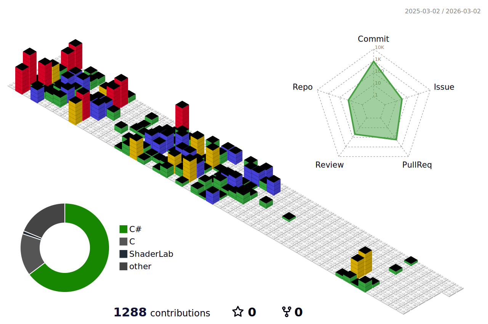

<!-- 전체 영역(배경 & 레이아웃) -->

<!-- 메인 컨테이너(가운데 정렬, 최대 너비 제한) -->
<a style="
max-width: 1000px;
margin: 0 auto;
background-color: #ffffff;
border-radius: 16px;
box-shadow: 0 8px 20px rgba(0, 0, 0, 0.08);
overflow: hidden;
">

<!-- =========================== 상단 헤더 이미지 =========================== -->

<!-- =========================== 소개 영역 =========================== -->

<!-- 방문자 수 -->

<h2 style="margin: 0 0 0.5rem 0;">
안녕하세요! 😄
</h2>

방문해주셔서 감사합니다! 열심히 성장 중입니다.

<!-- 구분선 -->

<!-- =========================== Stats & Trophies =========================== -->

<h3 style="text-align: center; margin-bottom: 2rem; font-size: 1.5rem;"> 📊 baekjoon Stats </h3>

<!-- solved.ac 백준 등급 -->

<!-- 백준 잔디 -->

<!-- =========================== GitHub Activity Graph (깃 잔디) =========================== -->
<h3 style="margin-bottom: 1.5rem; font-size: 1.5rem;">🌱 GitHub Activity Graph & Stats & Trophies</h3>

[//]: # ()

<!-- 3D GitHub Stats -->

[//]: # (![]&#40;./profile-3d-contrib/profile-gitblock.svg&#41;)

<!-- 잔디 지렁이 -->

<!-- git status -->
[//]: # ()

<!-- 총 사용한 언어들 통계 --> 
[//]: # ( )

<!-- Streak Stats -->
[//]: # ()

<!-- GitHub Trophies -->

<!-- 구분선 -->

<!-- =========================== Git-동물 키우기 =========================== -->

<h3 style="margin-bottom: 1.5rem; font-size: 1.5rem;">🐾 Git 동물 키우기</h3>

<!-- 구분선 -->

<!-- =========================== Tech Stack =========================== -->

<h3 style="text-align: center; margin-bottom: 2rem; font-size: 1.5rem;">
✨ Tech Stack ✨
</h3>

<!-- 예시: box-shadow & border-radius 공통 적용 -->

 

<!-- 구분선 -->

<!-- =========================== Studying =========================== -->

<h3 style="text-align: center; margin-bottom: 2rem; font-size: 1.5rem;">
📚 Studying
</h3>

<!-- 구분선 -->

<!-- =========================== Tools =========================== -->

<h3 style="text-align: center; margin-bottom: 2rem; font-size: 1.5rem;">
🛠 Tools
</h3>

             

<!-- vim -->

<!-- neovim -->

<!-- 구분선 -->

<!-- =========================== 푸터 =========================== -->

<strong>감사합니다! 😄</strong>

 <!-- 메인 컨테이너 종료 -->

 <!-- 전체 영역 종료 -->
