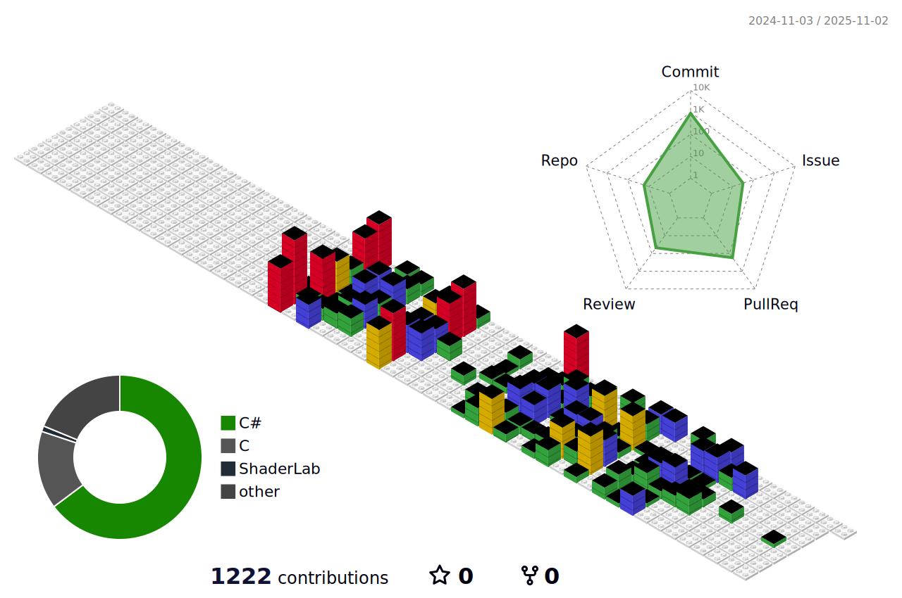

<!-- =========================== 헤더 섹션 =========================== -->
<div align="center">
    <a href="https://git.io/typing-svg">
        
    </a>
</div>

---

## 안녕하세요! 😄

방문해주셔서 감사합니다! 열심히 성장 중입니다.

---

<!-- =========================== 소셜 링크 =========================== --> <div align="center" style="background: linear-gradient(135deg, #667eea 0%, #764ba2 100%); padding: 2.5rem; border-radius: 25px; margin: 2rem 0; box-shadow: 0 15px 35px rgba(0,0,0,0.1);">

```html
<h3 style="color: white; 
           font-size: 2rem; 
           margin-bottom: 2rem; 
           text-shadow: 0 2px 10px rgba(0,0,0,0.3); 
           font-weight: 600;">
    🌐 Connect With Me
</h3>

<div style="display: flex; 
            flex-wrap: wrap; 
            justify-content: center; 
            gap: 20px; 
            max-width: 600px; 
            margin: 0 auto;">
    
    <a href="https://velog.io/@sic2kdif9/posts" 
       target="_blank" 
       style="text-decoration: none;">
        
    </a>
    
    <a href="https://github.com/PHSTD" 
       target="_blank" 
       style="text-decoration: none;">
        
    </a>
</div>
```

</div>

---

<!-- =========================== Tech Stack =========================== --> <div align="center" style="background: linear-gradient(135deg, #667eea 0%, #764ba2 100%); padding: 3rem; border-radius: 25px; margin: 2rem 0; box-shadow: 0 15px 35px rgba(0,0,0,0.1);">

```html
<h3 style="color: white; 
           font-size: 2.5rem; 
           margin-bottom: 3rem; 
           text-shadow: 0 2px 10px rgba(0,0,0,0.3); 
           font-weight: 600;">
    ✨ Tech Stack
</h3>

<!-- Backend & Language -->
<div style="margin-bottom: 2.5rem;">
    <h4 style="color: #FFE066; 
               font-size: 1.3rem; 
               margin-bottom: 1rem; 
               text-shadow: 0 2px 5px rgba(0,0,0,0.2);">
        🚀 Backend & Language
    </h4>
    
    <div style="display: flex; 
                flex-wrap: wrap; 
                justify-content: center; 
                gap: 12px; 
                margin-bottom: 1rem;">
        
        
        
        
        
        
        
        
        
        
    </div>
</div>

<!-- Frontend & UI -->
<div style="margin-bottom: 2.5rem;">
    <h4 style="color: #FFE066; 
               font-size: 1.3rem; 
               margin-bottom: 1rem; 
               text-shadow: 0 2px 5px rgba(0,0,0,0.2);">
        🎨 Frontend & UI
    </h4>
    
    <div style="display: flex; 
                flex-wrap: wrap; 
                justify-content: center; 
                gap: 12px; 
                margin-bottom: 1rem;">
        
        
        
        
        
        
        
        
        
        
        
        
        
        
    </div>
</div>

<!-- Database & Cloud -->
<div>
    <h4 style="color: #FFE066; 
               font-size: 1.3rem; 
               margin-bottom: 1rem; 
               text-shadow: 0 2px 5px rgba(0,0,0,0.2);">
        🗄️ Database & Cloud
    </h4>
    
    <div style="display: flex; 
                flex-wrap: wrap; 
                justify-content: center; 
                gap: 12px;">
        
        
        
        
        
        
    </div>
</div>
```

</div>

---

<!-- =========================== 현재 학습 중 =========================== --> <div align="center" style="margin: 3rem 0; padding: 2rem; background: linear-gradient(135deg, #667eea 0%, #764ba2 100%); border-radius: 25px; box-shadow: 0 15px 35px rgba(0,0,0,0.1);">

```html
<h3 style="color: white; 
           font-size: 2rem; 
           margin-bottom: 2rem; 
           text-shadow: 0 2px 10px rgba(0,0,0,0.3); 
           font-weight: 600;">
    📚 Currently Studying & Mastering
</h3>

<div style="display: flex; 
            flex-wrap: wrap; 
            justify-content: center; 
            gap: 15px; 
            max-width: 850px; 
            margin: 0 auto;">
    
    
    
    
    
    
    
    
    
    
    
    
</div>
```

</div>

---

<!-- =========================== 개발 도구 =========================== --> <div align="center" style="background: linear-gradient(135deg, #667eea 0%, #764ba2 100%); padding: 3rem; border-radius: 25px; margin: 2rem 0; box-shadow: 0 15px 35px rgba(0,0,0,0.1);">

```html
<h3 style="color: white; 
           font-size: 2.5rem; 
           margin-bottom: 3rem; 
           text-shadow: 0 2px 10px rgba(0,0,0,0.3); 
           font-weight: 600;">
    🛠 Development Tools
</h3>

<!-- Version Control -->
<div style="margin-bottom: 2.5rem;">
    <h4 style="color: #FFE066; 
               font-size: 1.3rem; 
               margin-bottom: 1rem; 
               text-shadow: 0 2px 5px rgba(0,0,0,0.2);">
        🔄 Version Control
    </h4>
    
    <div style="display: flex; 
                flex-wrap: wrap; 
                justify-content: center; 
                gap: 12px; 
                margin-bottom: 1rem;">
        
        
        
        
    </div>
</div>

<!-- Code Editors -->
<div style="margin-bottom: 2.5rem;">
    <h4 style="color: #FFE066; 
               font-size: 1.3rem; 
               margin-bottom: 1rem; 
               text-shadow: 0 2px 5px rgba(0,0,0,0.2);">
        📝 Code Editors
    </h4>
    
    <div style="display: flex; 
                flex-wrap: wrap; 
                justify-content: center; 
                gap: 12px; 
                margin-bottom: 1rem;">
        
        
        
        
        
        
    </div>
</div>

<!-- IDEs -->
<div>
    <h4 style="color: #FFE066; 
               font-size: 1.3rem; 
               margin-bottom: 1rem; 
               text-shadow: 0 2px 5px rgba(0,0,0,0.2);">
        💻 JetBrains IDEs
    </h4>
    
    <div style="display: flex; 
                flex-wrap: wrap; 
                justify-content: center; 
                gap: 12px;">
        
        
        
        
        
        
        
        
        
        
        
        
    </div>
</div>
```

</div>

---

<!-- =========================== 백준 통계 =========================== --> <div style="padding: 2rem; text-align: center;">

```html
<h3 style="text-align: center; 
           margin-bottom: 2rem; 
           font-size: 1.5rem;"> 
    📊 Baekjoon Stats 
</h3>

<!-- solved.ac 백준 등급 -->
<a href="https://www.acmicpc.net/" 
   target="_blank" 
   rel="noopener noreferrer">
    
</a>

<!-- 백준 잔디 -->
<a href="https://www.acmicpc.net/" 
   target="_blank" 
   rel="noopener noreferrer">
    
</a>
```

</div>

---

<!-- =========================== GitHub 활동 =========================== --> <div style="padding: 2rem; text-align: center;">

```html
<h3 style="margin-bottom: 1.5rem; 
           font-size: 1.5rem;">
    🌱 GitHub Activity Graph & Stats & Trophies
</h3>

<!-- 3D GitHub Stats -->


<!-- 잔디 지렁이 -->


<!-- GitHub Stats -->


<!-- Streak Stats -->
<a href="https://git.io/streak-stats">
    
</a>
```

</div>

---

<!-- =========================== GitHub 프로필 요약 카드 =========================== --> <p align="center">

```html


```

</p>

---

<!-- =========================== 언어 사용률 & 시간 추적 =========================== --> <div align="center">

```html


<figure>
    
    
    
    
    
    
    
</figure>

<!-- GitHub Trophies -->

```

</div>

---

<!-- =========================== Git 동물 키우기 =========================== --> <div style="padding: 2rem; text-align: center;">

```html
<h3 style="margin-bottom: 1.5rem; 
           font-size: 1.5rem;">
    🐾 Git 동물 키우기
</h3>

<a href="https://www.gitanimals.org/en_US?utm_medium=image&utm_source=PHSTD&utm_content=farm">
    
</a>
```

</div>

---

<!-- =========================== 방문자 수 =========================== --> <div align="center" style="margin: 0 auto;">

```html

```

</div>

---

<!-- =========================== 마무리 =========================== --> <div style="text-align: center; padding: 1rem; background-color: #f5f5f5;">

```html
<strong>감사합니다! 😄</strong>
```

</div>